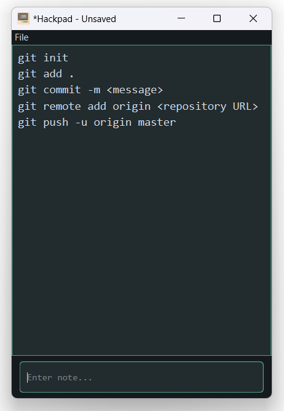
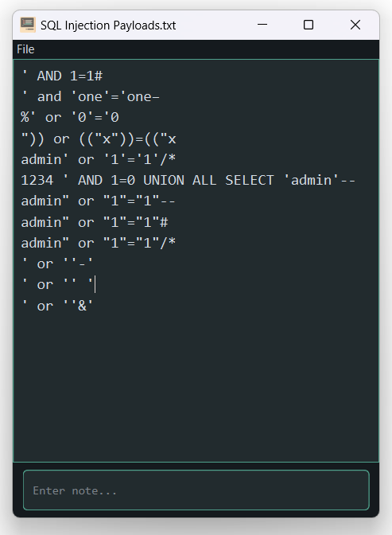
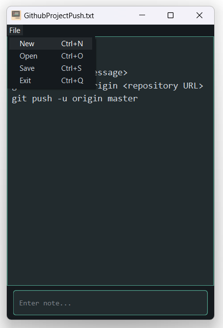
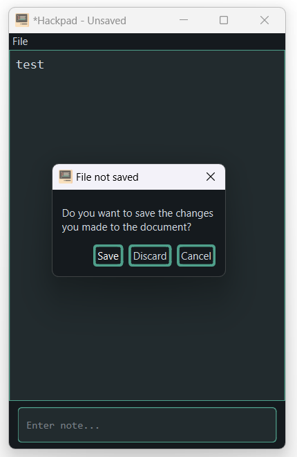

# Hackpad - Simple Step by Step Notepad

Hackpad is a simple text note application developed with Python. It allows you to take notes step by step and push them with the press of the enter key.

## Getting Started
### Prerequisites
To use Notepad, you'll need to have Python installed on your computer. You can download Python from the official website:

https://www.python.org/downloads/

### Installing

```bash
git clone https://github.com/emretuncer256/Hackpad.git
```

## How to Use
To run hackpad, there are 2 options:
- Run with using console
- Double-click Hackpad.exe file.

Run code with using command below:
```bash
python src\app.py
```

### .exe File
Hackpad.exe file is located in `dist>app` folder.

## Screenshots
<table border="1">
    <tr>
        <td>
            <center>
                <h3>HackpadSampleScreenshot1.png</h3>
                
            </center>
        </td>
        <td>
            <center>
                <h3>HackpadSampleScreenshot2.png</h3>
                
            </center>
        </td>
    </tr>
    <tr>
        <td>
            <center>
                <h3>HackpadActionsScreenshot1.png</h3>
                
            </center>
        </td>
        <td>
            <center>
                <h3>HackpadActionsScreenshot2.png</h3>
                
            </center>
        </td>
    </tr>
</table>

## Contributing
If you'd like to contribute to Notepad, feel free to submit a pull request on GitHub. We welcome all contributions!

## License
Hackpad is released under the [MIT](https://opensource.org/license/mit/) License.
